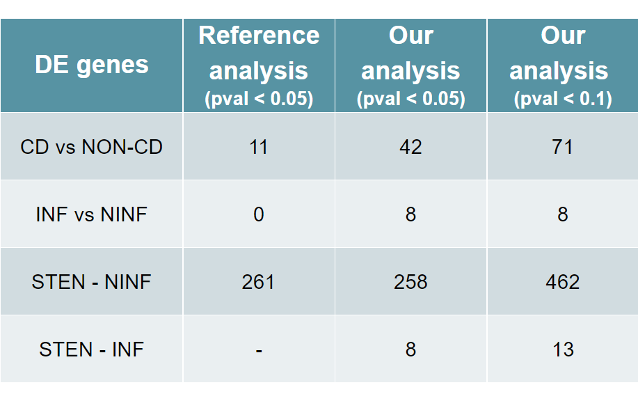

```{=html}
<style>
p.caption {
  font-size: 0.8em;
  font-weight: bold;
}
</style>
```
```{r setup, include=FALSE}
knitr::opts_chunk$set(echo = TRUE)
colorize <- function(x, color) {
  if (knitr::is_latex_output()) {
    sprintf("\\textcolor{%s}{%s}", color, x)
  } else if (knitr::is_html_output()) {
    sprintf("<span style='color: %s;'>%s</span>", color, 
      x)
  } else x
}
```
{width=600px}

# Introduction

#### **Aim of the paper**
*Understand the pathophysiology of fibro-stenotic complications due to intestinal inflammation characteristic of Crohn's disease.*

#### **Disease development**
{width=750px}

#### **Patients and samples**
21 samples from 14 unique patients.
{width=750px}

#### **Data pre-processing**
For the differential gene expression analysis, raw sequences were merged per sample and checked for quality using **FastQC** and **MultiQC**. The sequences were then aligned to the reference **genome GRCh38** using **STAR**, and sorted and converted into binary files using **SAMtools**. Reads were counted and annotated using the Ensembl annotations using the **featureCounts** module in the Subread package.

# Setup 

All the necessary libraries for the analysis are uploaded.
```{r,results='hide', message=FALSE, warning=FALSE}
library("SummarizedExperiment")
library("ggplot2")
library("RColorBrewer")
library("clusterProfiler")
library("genefilter")
library("pheatmap")
library("org.Hs.eg.db")
library("fdrtool")
library("DESeq2")
library("limma")
library("ashr")
```


Raw Counts matrix and corresponding metadata are uploaded. Genes are not considered if they have less than 1 count per million (CPM) in more than 11 samples.
```{r,warning=FALSE,message=FALSE,echo=-1}
setwd("C:/Users/Stefano/OneDrive - Politecnico di Bari/Documenti/Univr/Programming for bioinformatics/RNA_analysisCrohn/data/GENDX000019")
df <- read.delim("GENDX000019_GeneMatrix_rawCounts.txt", row.names=1)
metadata <- read.delim("GEND000019-meta.txt", row.names=5)

df1 <- df[rowSums(df>1) >= 11,]
genes <- row.names(df1)
df1<- as.data.frame(lapply(df1, as.integer))

row.names(df1) <- substr(genes, 1, 15)

head(df1)
```

A new categorical metadata column is created from the continuous variable Age. Samples with age between 17 and 39 are assigned to one level, samples being 40 year old or more to the other one.
```{r}
metadata$Age.Level <-  cut(metadata$Age, c(17, 40, 80))
metadata[, c("Gender", "Disease", "Disease.State", "Age", "Age.Level")]
```


# DE analysis (CD vs non-CD)
In order to investigate in deep the differential expression of genes, two different designs are carried out.
The first one is focused in comparing **Healthy controls** vs **Chron's disease samples**, correcting for Gender, Age and Passage number (the number of times the cell culture has been subcultured).

```{r, message=FALSE, warning=FALSE}
dds1 <- DESeqDataSetFromMatrix(df1, colData=metadata, 
                               design = ~ Gender + Age.Level + Development.Stage + Disease)

rld1 <- rlog(dds1, blind=FALSE)
```


### PCA plots
A principal component analysis (PCA) plot allows to visualize the patterns of variability in the data.

```{r, warning=FALSE, message=FALSE}
plotPCA(rld1, intgroup = c("Disease")) + 
  theme(panel.background = element_rect(fill = "#d5eff1",colour = "#d5eff1",size = 0.5, 
  linetype = "solid"), panel.grid.major = element_line(size = 0.5, linetype = 'solid', 
  colour = "white"), panel.grid.minor = element_line(size = 0.25, linetype = 'solid', 
  colour = "white"))

plotPCA(rld1, intgroup = c("Gender", "Disease")) + 
  theme(panel.background = element_rect(fill = "#d5eff1",colour = "#d5eff1",size = 0.5, 
  linetype = "solid"), panel.grid.major = element_line(size = 0.5, linetype = 'solid', 
  colour = "white"), panel.grid.minor = element_line(size = 0.25, linetype = 'solid', 
  colour = "white"))

plotPCA(rld1, intgroup = c("Age.Level", "Disease")) + 
  theme(panel.background = element_rect(fill = "#d5eff1",colour = "#d5eff1",size = 0.5, 
  linetype = "solid"), panel.grid.major = element_line(size = 0.5, linetype = 'solid', 
  colour = "white"), panel.grid.minor = element_line(size = 0.25, linetype = 'solid', 
  colour = "white"))
```

### DESeq Results
**DESeq()** function is applied to perform the actual differential expression analysis and the results are stored in res1 object.
```{r, message = FALSE}
dds1 <- DESeq(dds1)
res1<-results(dds1)
summary(res1)
```
71 genes show a significant up or down regulation (padj < 0.1).
They are now ordered by a log2FoldChange decreasing order.

```{r}
resSig1 <- subset(res1, padj < 0.1)
resSig1 <- resSig1[order(resSig1$log2FoldChange, decreasing=T), ]
head(resSig1)
```
The following code is used to investigate if there are genes that show a value of expression in a condition that is half or double compared to its expression in the other condition.
In this case, only 2 genes are expressed in Chron's disease samples with a value that is half of the expression observed among controls.

```{r}
resLFC1 <- results(dds1, lfcThreshold=1)
summary(resLFC1)
```


### Plot results

#### **Dot plots**
The function **plotCount()** shows the counts of sequencing reads for a particular gene of interest in each sample. The genes selected are those presenting the smallest padj. 

```{r}
topGenes1<-rownames(res1[order(res1$padj, decreasing=F),])

plotCounts(dds1, gene=topGenes1[1], intgroup=c("Disease"))
plotCounts(dds1, gene=topGenes1[5], intgroup=c("Disease"))
```

#### **MA plots**
The MA plot represents the LFC of the genes as a function of the average expression between the two conditions, which are theoretically equivalent information between the two experimental conditions.

```{r}
resultsNames(dds1)
res1_Disease_MA <- results(dds1, contrast = list("Disease_Healthy.Control_vs_Crohn.s.Disease" ))
DESeq2::plotMA(res1_Disease_MA, ylim=c(-5,5))

res1_Gender_MA <- results(dds1, contrast = list("Gender_male_vs_female"))
DESeq2::plotMA(res1_Gender_MA, ylim=c(-5,5))

res1_Age_MA <- results(dds1, contrast = list("Age.Level_.40.80._vs_.17.40."))
DESeq2::plotMA(res1_Age_MA, ylim=c(-5,5))

```

#### **P-value distribution**
An histogram of p-values distribution is plotted to investigate the reliability of the analysis.
```{r}
hist(res1$pvalue[res1$baseMean > 1], breaks=0:20/20, col="royalblue4", border="white", main = "CD vs non-CD", xlab = "p-values")
```


Since a proper p-value distribution has a rectangular shape with a peak at 0, a correction is performed.

```{r}
res1_corr <- res1[ !is.na(res1$padj),]
res1_corr <- res1_corr[ !is.na(res1_corr$pvalue), ]
res1_corr <- res1_corr[, -which(names(res1_corr) == "padj")]
res_fdr1 <- fdrtool(res1_corr$stat, statistic= "normal", plot = T)
res1_corr[,"padj"] <- p.adjust(res_fdr1$pval, method = "BH")
hist(res_fdr1$pval, col = "royalblue4", xlab = "CORRECTED p-values", border="white", main = "CD vs non-CD")
```

#### **Heatmap**
A clustered heatmap is plotted over Disease and Gender using the 20 more variant genes among samples.
Since the influence of Gender on gene expression is evident, a new heatmap is plotted after removing Batch effect of Gender.
```{r pheatmap}
library("genefilter")
library("clusterProfiler")
library("pheatmap")

#More variant genes among samples
topVarGenes1 <- order(rowVars(assay(rld1)),decreasing=TRUE)
mat1 <- assay(rld1)[topVarGenes1, ]
mat1 <- mat1 - rowMeans(mat1)

new_mat1 <- removeBatchEffect(mat1, batch= colData(rld1)$Gender)

df_clust1 <- as.data.frame(colData(rld1)[,c("Gender","Disease")])


pheatmap(head(mat1, 20), annotation_col=df_clust1, main = "Heatmap with Batch effect of Gender", cluster_cols = T)

pheatmap(head(new_mat1, 20), annotation_col=df_clust1, main = "Heatmap without Batch effect of Gender",cluster_cols = F)
```


### Enrichment
Once the differentially expressed genes have been identified, enrichment analysis can be used to identify the biological pathways, gene ontology terms, or functional categories that are more common in the list of DE genes.

Enrichment analysis is performed using two databases: **Gene Ontology (GO)** and **Kyoto Encyclopedia of Genes and Genomes (KEGG)**.
```{r}
geneList_DESeq1 <- resSig1$log2FoldChange
names(geneList_DESeq1) <- rownames(resSig1)
```

#### **Gene Ontology (GO)**

```{r, warning=FALSE, message=FALSE}
#Molecular Function
ego1MF <- enrichGO(gene = names(geneList_DESeq1), OrgDb = org.Hs.eg.db,
                   keyType = 'ENSEMBL', ont = "MF", pAdjustMethod = "BH",
                   pvalueCutoff  = 0.1, readable = T)

head(ego1MF)
goplot(ego1MF)

#Cellular Component
ego1CC <- enrichGO(gene = names(geneList_DESeq1), OrgDb = org.Hs.eg.db,
                   keyType = 'ENSEMBL', ont = "CC", pAdjustMethod = "BH",
                   pvalueCutoff  = 0.1, readable = T)
                
head(ego1CC)

#Biological Process
ego1BP <- enrichGO(gene = names(geneList_DESeq1), OrgDb = org.Hs.eg.db,
                   keyType = 'ENSEMBL', ont = "BP", pAdjustMethod = "BH",
                   pvalueCutoff  = 0.1, readable = T)

head(ego1BP)
```


#### **Kyoto Encyclopedia of Genes and Genomes (KEGG)**
In order to use the KEGG database, ENSEMBL ID are converted in ENTREZID. An higher p-value threshold (padj < 0.5) is needed because of the low number of DE genes having a smaller p-value.
```{r, message = FALSE, warning=FALSE}
resSig1_KEGG <- subset(res1, padj < 0.5)
resSig1_KEGG <- resSig1_KEGG[order(resSig1_KEGG$log2FoldChange, decreasing=T), ]

geneList_DESeq1_1 <- resSig1_KEGG$log2FoldChange
names(geneList_DESeq1_1) <- row.names(resSig1_KEGG)

gene_df1 <- bitr(names(geneList_DESeq1_1), fromType = "ENSEMBL",
                 toType = "ENTREZID", OrgDb = org.Hs.eg.db)
                
geneList_df1 <- resSig1_KEGG$log2FoldChange    
names(geneList_df1) <- gene_df1$ENTREZID

kk1 <- enrichKEGG(gene = gene_df1$ENTREZID, organism = 'hsa', pvalueCutoff = 0.1)

head(kk1)
```

# DE analysis (IN, SN, SI)
The second analysis is designed focusing on the differences due to the Disease State. In particular, 3 comparisons are carried out:

- Inflamed vs Non-Inflamed

- Stenotic vs Non-Inflamed

- Stenotic vs Inflamed

The Disease State variable is releveled. 

The first 2 comparisons use "non-inflamed" as reference level while the third one uses "inflamed" category as reference level.

```{r}
metadata$Disease.State <- as.factor(metadata$Disease.State)
metadata$Disease.State <- relevel(metadata$Disease.State, "non-inflamed")

metadata$Disease.State1 <- as.factor(metadata$Disease.State)
metadata$Disease.State1 <- relevel(metadata$Disease.State, "inflamed")

```

```{r, message = FALSE, warning=FALSE}
dds2 <- DESeqDataSetFromMatrix(df1, colData=metadata,
                               design = ~ Gender + Age.Level  + Development.Stage + Disease.State)

rld2 <- rlog(dds2, blind=FALSE)


dds2_SI <- DESeqDataSetFromMatrix(df1, colData=metadata,
                                  design = ~ Gender + Age.Level  + Development.Stage + Disease.State1)

rld2_SI <- rlog(dds2_SI, blind=FALSE)
```


### PCA plots
A principal component analysis (PCA) plot allows to visualize the patterns of variability in the data.
```{r, warning=FALSE, message=FALSE}
plotPCA(rld2, intgroup = c("Disease", "Disease.State")) + 
  theme(panel.background = element_rect(fill = "#d5eff1",colour = "#d5eff1",size = 0.5, 
  linetype = "solid"), panel.grid.major = element_line(size = 0.5, linetype = 'solid', 
  colour = "white"), panel.grid.minor = element_line(size = 0.25, linetype = 'solid', 
  colour = "white"))
```

### DESeq results
**DESeq()** function is applied to perform the actual differential expression analysis and the results are stored in res2 and res2_SI objects.

```{r, message = FALSE, warning=FALSE}
dds2 <- DESeq(dds2)
res2<-results(dds2)
summary(res2)

dds2_SI <- DESeq(dds2_SI)
res2_SI <- results(dds2_SI)
summary(res2_SI)
```

For the non-inflamed reference level case, 462 genes show a significant up or down regulation (padj < 0.1). 

For the inflamed reference level case, 13 genes show a significant up or down regulation (padj < 0.1).

They are now ordered by a log2FoldChange decreasing order.
```{r}
resSig2 <- subset(res2, padj < 0.1)
resSig2 <- resSig2[order(resSig2$log2FoldChange, decreasing=T), ]
head(resSig2)

resSig2_SI <- subset(res2_SI, padj < 0.1)
resSig2_SI <- resSig2_SI[order(resSig2_SI$log2FoldChange, decreasing=T), ]
head(resSig2_SI)
```

#### **Shrinkage**
Too large log2FoldChange values suggest to perform **shrinkage** for the 3 different comparisons.

```{r, message = FALSE, warning = FALSE}
#INF vs NINF
res2_inf_noninf <- lfcShrink(dds2, coef="Disease.State_inflamed_vs_non.inflamed", type="normal")

res2_inf_noninf <- subset(res2_inf_noninf, padj < 0.1)
res2_inf_noninf <- res2_inf_noninf[order(res2_inf_noninf$log2FoldChange, decreasing=T), ]
head(res2_inf_noninf)


#STEN vs NINF
res2_sten_noninf <- lfcShrink(dds2, coef = "Disease.State_stenotic_vs_non.inflamed", type = "normal")

res2_sten_noninf <- subset(res2_sten_noninf, padj < 0.1)
res2_sten_noninf <- res2_sten_noninf[order(res2_sten_noninf$log2FoldChange, decreasing=T), ]
head(res2_sten_noninf)


#STEN vs INF
res2_sten_inf <- lfcShrink(dds2_SI, coef = "Disease.State1_stenotic_vs_inflamed", type = "normal")

res2_sten_inf <- subset(res2_sten_inf, padj < 0.1)
res2_sten_inf <- res2_sten_inf[order(res2_sten_inf$log2FoldChange, decreasing=T), ]
head(res2_sten_inf)

```


The following code is used to investigate if there are genes that show a value of expression in a condition that is half or double compared to its expression in the other condition. In this case, 12 genes are expressed in Chron’s disease samples with a value that is half of the expression observed among controls while just 1 shows a double expression.
```{r}
resLFC2 <- results(dds2, lfcThreshold=1)
summary(resLFC2)
```

### Plot results

#### **Dot plots**
The read counts of the gene with the smallest padj, one for each comparison, are plotted.

```{r, warning=FALSE, message=FALSE}
#INF vs NINF
topGenes2_IN<-rownames(res2_inf_noninf[order(res2_inf_noninf$padj),])
geneCounts2_IN <- plotCounts(dds2, gene=topGenes2_IN[1],
                             intgroup=c("Disease.State"), returnData=T)
ggplot(geneCounts2_IN, aes(x=Disease.State, y=count, fill=Disease.State)) +
  scale_y_log10() + geom_dotplot(binaxis="y", stackdir="center") + 
  theme(panel.background = element_rect(fill = "#d5eff1",colour = "#d5eff1",size = 0.5, 
  linetype = "solid"), panel.grid.major = element_line(size = 0.5, linetype = 'solid', 
  colour = "white"), panel.grid.minor = element_line(size = 0.25, linetype = 'solid', 
  colour = "white"))

#STEN vs NINF
topGenes2_SN<-rownames(res2_sten_noninf[order(res2_sten_noninf$padj),])
geneCounts2_SN <- plotCounts(dds2, gene=topGenes2_SN[1],
                             intgroup=c("Disease.State"), returnData=T)
ggplot(geneCounts2_SN, aes(x=Disease.State, y=count, fill=Disease.State)) +
  scale_y_log10() + geom_dotplot(binaxis="y", stackdir="center") + 
  theme(panel.background = element_rect(fill = "#d5eff1",colour = "#d5eff1",size = 0.5, 
  linetype = "solid"), panel.grid.major = element_line(size = 0.5, linetype = 'solid', 
  colour = "white"), panel.grid.minor = element_line(size = 0.25, linetype = 'solid', 
  colour = "white"))

#STEN vs INF
topGenes2_SI<-rownames(res2_sten_inf[order(res2_sten_inf$padj),])
geneCounts2_SI <- plotCounts(dds2_SI, gene=topGenes2_SI[1],
                             intgroup=c("Disease.State"), returnData=T)
ggplot(geneCounts2_SI, aes(x=Disease.State, y=count, fill=Disease.State)) +
  scale_y_log10() + geom_dotplot(binaxis="y", stackdir="center") + 
  theme(panel.background = element_rect(fill = "#d5eff1",colour = "#d5eff1",size = 0.5, 
  linetype = "solid"), panel.grid.major = element_line(size = 0.5, linetype = 'solid', 
  colour = "white"), panel.grid.minor = element_line(size = 0.25, linetype = 'solid', 
  colour = "white"))
```


#### **MA plots**
The MA plot represents the LFC of the genes as a function of the average expression between the two conditions, which are theoretically equivalent information between the two experimental conditions.

```{r}
#INF vs NINF
res2_IN_MA <- results(dds2,
                      contrast = list("Disease.State_inflamed_vs_non.inflamed"))
DESeq2::plotMA(res2_IN_MA)

#STEN vs NINF
res2_SN_MA <- results(dds2,
                      contrast = list("Disease.State_stenotic_vs_non.inflamed"))
DESeq2::plotMA(res2_SN_MA)

#STEN vs INF
res2_SI_MA <- results(dds2_SI,
                      contrast = list("Disease.State1_stenotic_vs_inflamed"))
DESeq2::plotMA(res2_SI_MA)
```

#### **P-value distribution**
An histogram of p-values distribution is plotted to investigate the reliability of the analysis.

```{r}
#INF vs NINF
hist(res2_IN_MA$pvalue[res2_IN_MA$baseMean > 1], breaks=0:20/20, col="royalblue4", border="white", main = "INF vs NINF", xlab = "p-values")

res2_IN_corr <- res2_IN_MA[ !is.na(res2_IN_MA$padj),] 
res2_IN_corr <- res2_IN_corr[ !is.na(res2_IN_corr$pvalue), ]
res2_IN_corr <- res2_IN_corr[, -which(names(res2_IN_corr) == "padj")]
res_fdr2_IN<- fdrtool(res2_IN_corr$stat, statistic= "normal", plot = F)
res2_IN_corr[,"padj"] <- p.adjust(res_fdr2_IN$pval, method = "BH")
hist(res_fdr2_IN$pval, col = "royalblue4", main = "INF vs NINF", xlab = "CORRECTED p-values", border="white")


#STEN vs NINF
hist(res2_SN_MA$pvalue[res2_SN_MA$baseMean > 1], breaks=0:20/20, col="royalblue4", border="white", main = "STEN vs NINF", xlab = "p-values")

res2_SN_corr <- res2_SN_MA[ !is.na(res2_SN_MA$padj),] 
res2_SN_corr <- res2_SN_corr[ !is.na(res2_SN_corr$pvalue), ]
res2_SN_corr <- res2_SN_corr[, -which(names(res2_SN_corr) == "padj")]
res_fdr2_SN <- fdrtool(res2_SN_corr$stat, statistic= "normal", plot = F)
res2_SN_corr[,"padj"] <- p.adjust(res_fdr2_SN$pval, method = "BH")
hist(res_fdr2_SN$pval, col = "royalblue4", main = "STEN vs NINF", xlab = "CORRECTED p-values", border="white")


#STEN vs INF
hist(res2_SI_MA$pvalue[res2_SI_MA$baseMean > 1], breaks=0:20/20, col="royalblue4", border="white", main = "STEN vs INF", xlab = "p-values")

res2_SI_corr <- res2_SI_MA[ !is.na(res2_SI_MA$padj),] 
res2_SI_corr <- res2_SI_corr[ !is.na(res2_SI_corr$pvalue), ]
res2_SI_corr <- res2_SI_corr[, -which(names(res2_SI_corr) == "padj")]
res_fdr2_SI <- fdrtool(res2_SI_corr$stat, statistic= "normal", plot = F)
res2_SI_corr[,"padj"] <- p.adjust(res_fdr2_SI$pval, method = "BH")
hist(res_fdr2_SI$pval, col = "royalblue4", main = "STEN vs INF", xlab = "CORRECTED p-values", border="white")
```

#### **Heatmap**
Clustered heatmaps, after removing Batch effect of Gender, are plotted over Disease.State and Gender using the 20 most variant genes among samples.

```{r}
#Most variant genes among samples
topVarGenes2 <- order(rowVars(assay(rld2)),decreasing=TRUE) 
mat2 <- assay(rld2)[topVarGenes2, ]
mat2 <- mat2 - rowMeans(mat2)
new_mat2 <- removeBatchEffect(mat2, batch= colData(rld2)$Gender) 

df_clust2 <- as.data.frame(colData(rld2)[,c("Gender","Disease.State")])
pheatmap(head(new_mat2, 20), annotation_col=df_clust2, main = "Heatmap without Batch effect on Gender", cluster_cols = F)
```

Clustered heatmaps, after removing Batch effect of Gender, are plotted over Disease.State and Gender using the most significantly DE genes among samples.

```{r}
#Most significantly DE genes
#IN
res2_inf_noninf_LFC <- res2_inf_noninf[order(abs(res2_inf_noninf$log2FoldChange), decreasing = T),]
topDEGenes2_IN <- new_mat2[rownames(res2_inf_noninf_LFC),]
pheatmap(topDEGenes2_IN, annotation_col=df_clust2, main = "Heatmap INF vs NINF", cluster_cols = F)

#SN
res2_sten_noninf_LFC <-res2_sten_noninf[order(abs(res2_sten_noninf$log2FoldChange),
                                               decreasing = T),]
topDEGenes2_SN <- new_mat2[rownames(res2_sten_noninf_LFC),]
pheatmap(head(topDEGenes2_SN,20), annotation_col=df_clust2, main = "Heatmap STEN vs NINF", cluster_cols = F)

#SI
res2_sten_inf_LFC <-res2_sten_inf[order(abs(res2_sten_inf$log2FoldChange),
                                               decreasing = T),]
topDEGenes2_SI <- new_mat2[rownames(res2_sten_inf_LFC),]
pheatmap(topDEGenes2_SI, annotation_col=df_clust2, main = "Heatmap  STEN vs INF", cluster_cols = F)
```


### Enrichment
Once the differentially expressed genes have been identified, enrichment analysis can be used to identify the biological pathways, gene ontology terms, or functional categories that are more common in the list of DE genes.

Enrichment analysis is performed using two databases: **Gene Ontology (GO)** and **Kyoto Encyclopedia of Genes and Genomes (KEGG)**.
```{r}
geneList_DESeq2_IN <- res2_inf_noninf$log2FoldChange
names(geneList_DESeq2_IN) <- rownames(res2_inf_noninf)

geneList_DESeq2_SN <- res2_sten_noninf$log2FoldChange
names(geneList_DESeq2_SN) <- rownames(res2_sten_noninf)


geneList_DESeq2_SI <- res2_sten_inf$log2FoldChange
names(geneList_DESeq2_SI) <- rownames(res2_sten_inf)
```

#### **Gene Ontology (GO)**

```{r, warning=FALSE, message=FALSE}
#INF VS NINF
#Molecular Function
ego2MF_IN <- enrichGO(gene = names(geneList_DESeq2_IN), OrgDb = org.Hs.eg.db,
                   keyType = 'ENSEMBL', ont = "MF", pAdjustMethod = "BH",
                   pvalueCutoff  = 0.1, readable = T)

head(ego2MF_IN)
goplot(ego2MF_IN)

#Cellular Components
ego2CC_IN <- enrichGO(gene = names(geneList_DESeq2_IN), OrgDb = org.Hs.eg.db,
                   keyType = 'ENSEMBL', ont = "CC", pAdjustMethod = "BH",
                   pvalueCutoff  = 0.1, readable = T)
                
head(ego2CC_IN)
goplot(ego2CC_IN)

#Biological Process
ego2BP_IN <- enrichGO(gene = names(geneList_DESeq2_IN), OrgDb = org.Hs.eg.db,
                   keyType = 'ENSEMBL', ont = "BP", pAdjustMethod = "BH",
                   pvalueCutoff  = 0.1, readable = T)

head(ego2BP_IN)
goplot(ego2BP_IN)

#STEN VS NINF
#Molecular Function
ego2MF_SN <- enrichGO(gene = names(geneList_DESeq2_SN), OrgDb = org.Hs.eg.db,
                      keyType = 'ENSEMBL', ont = "MF", pAdjustMethod = "BH",
                      pvalueCutoff  = 0.1, readable = T)

head(ego2MF_SN)
goplot(ego2MF_SN)

#Cellular Components
ego2CC_SN <- enrichGO(gene = names(geneList_DESeq2_SN), OrgDb = org.Hs.eg.db,
                      keyType = 'ENSEMBL', ont = "CC", pAdjustMethod = "BH",
                      pvalueCutoff  = 0.1, readable = T)
                
head(ego2CC_SN)
goplot(ego2CC_SN)

#Biological Process
ego2BP_SN <- enrichGO(gene = names(geneList_DESeq2_SN), OrgDb = org.Hs.eg.db,
                      keyType = 'ENSEMBL', ont = "BP", pAdjustMethod = "BH",
                      pvalueCutoff  = 0.1, readable = T)

head(ego2BP_SN)
goplot(ego2BP_SN)


#STEN VS INF
#Molecular Function
ego2MF_SI <- enrichGO(gene = names(geneList_DESeq2_SI), OrgDb = org.Hs.eg.db,
                      keyType = 'ENSEMBL', ont = "MF", pAdjustMethod = "BH",
                      pvalueCutoff  = 0.1, readable = T)

head(ego2MF_SI)
goplot(ego2MF_SI)

#Cellular Components
ego2CC_SI <- enrichGO(gene = names(geneList_DESeq2_SI), OrgDb = org.Hs.eg.db,
                      keyType = 'ENSEMBL', ont = "CC", pAdjustMethod = "BH",
                      pvalueCutoff  = 0.1, readable = T)
                
head(ego2CC_SI)
goplot(ego2CC_SI)

#Biological Process
ego2BP_SI <- enrichGO(gene = names(geneList_DESeq2_SI), OrgDb = org.Hs.eg.db,
                      keyType = 'ENSEMBL', ont = "BP", pAdjustMethod = "BH",
                      pvalueCutoff  = 0.1, readable = T)

head(ego2BP_SI)
goplot(ego2BP_SI)
```


#### **Kyoto Encyclopedia of Genes and Genomes (KEGG)**
In order to use the KEGG database, ENSEMBL ID are converted in ENTREZID. An higher p-value threshold (padj < 0.3) is needed for the Stenotic-Inflamed comparison because of the low number of DE genes having a smaller p-value.

```{r, warning=FALSE, message=FALSE}
#INF VS NINF
gene_df2_IN <- bitr(names(geneList_DESeq2_IN), fromType = "ENSEMBL",
                 toType = "ENTREZID", OrgDb = org.Hs.eg.db)
geneList_df2_IN <- res2_inf_noninf$log2FoldChange    
names(geneList_df2_IN) <- gene_df2_IN$ENTREZID

kk2_IN <- enrichKEGG(gene = gene_df2_IN$ENTREZID, organism = 'hsa', pvalueCutoff = 0.1)
head(kk2_IN)


#STEN VS NINF
gene_df2_SN <- bitr(names(geneList_DESeq2_SN), fromType = "ENSEMBL",
                 toType = "ENTREZID", OrgDb = org.Hs.eg.db)
geneList_df2_SN <- res2_sten_noninf$log2FoldChange    
names(geneList_df2_SN) <- gene_df2_SN$ENTREZID

kk2_SN <- enrichKEGG(gene = gene_df2_SN$ENTREZID, organism = 'hsa', pvalueCutoff = 0.1)
head(kk2_SN)


#STEN VS INF
gene_df2_SI <- bitr(names(geneList_DESeq2_SI), fromType = "ENSEMBL",
                    toType = "ENTREZID", OrgDb = org.Hs.eg.db)
geneList_df2_SI <- res2_sten_inf$log2FoldChange    
names(geneList_df2_SI) <- gene_df2_SI$ENTREZID

kk2_SI <- enrichKEGG(gene = gene_df2_SI$ENTREZID, organism = 'hsa', pvalueCutoff = 0.3)
head(kk2_SI)
```

# Conclusions

#### **Pathway analysis discussion**
In the paper, by performing pathway analysis on the differentially methylated regions (DMRs) and differentially expressed genes (DEGs), they observed dysregulation of genes associated to **cellular differentiation**, **morphogenesis**, and **extracellular matrix remodeling**.

{width=500px}

#### **DE genes**
{width=500px}

#### **Relevant genes**

{width=800px}

*To conclude our results are coherent with those obtained in the paper, as well as with the Crohn's disease scenario. In particular, clear distinctions are observed when comparing stenotic and non-inflamed samples.*
